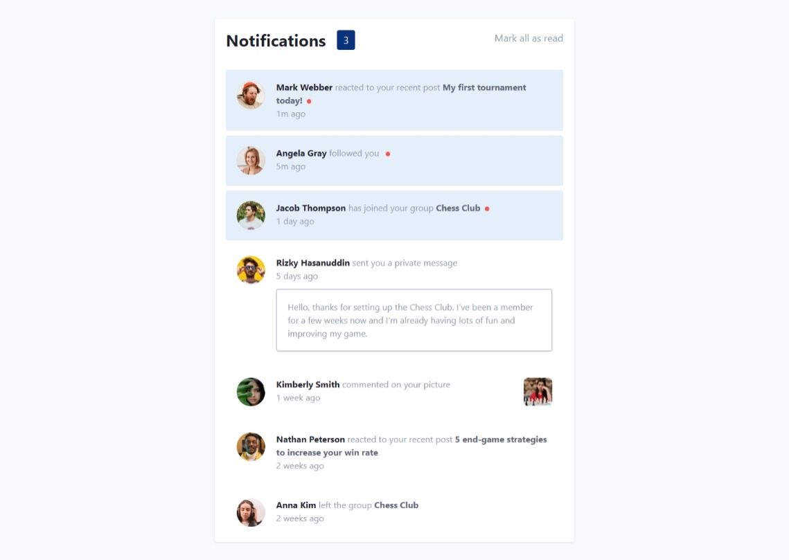

# Frontend Mentor - Notifications page solution

This is a solution to the [Notifications page challenge on Frontend Mentor](https://www.frontendmentor.io/challenges/notifications-page-DqK5QAmKbC). Frontend Mentor challenges help you improve your coding skills by building realistic projects. 

## Table of contents

- [Overview](#overview)
  - [The challenge](#the-challenge)
  - [Screenshot](#screenshot)
  - [Links](#links)
- [My process](#my-process)
  - [Built with](#built-with)
  - [What I learned](#what-i-learned)
  - [Continued development](#continued-development)
  - [Useful resources](#useful-resources)
- [Setting up Project](#setting-up-project)
  - [Recommended IDE Setup](#recommended-ide-setup)
  - [Project Scaffolding](#project-scaffolding)
    - [Compile and Hot-Reload for Development](#compile-and-hot-reload-for-development)
    - [Compile and Minify for Production](#compile-and-minify-for-production)
- [Author](#author)

**Note: Delete this note and update the table of contents based on what sections you keep.**

## Overview

### The challenge

Users should be able to:

- Distinguish between "unread" and "read" notifications
- Select "Mark all as read" to toggle the visual state of the unread notifications and set the number of unread messages to zero
- View the optimal layout for the interface depending on their device's screen size
- See hover and focus states for all interactive elements on the page

### Screenshot



### Links

- Solution URL: [Github Repo](https://your-solution-url.com)
- Live Site URL: [Live Site](https://your-live-site-url.com)

## My process

### Built with

- Semantic HTML5 markup
- Flexbox
- CSS Grid
- Mobile-first workflow
- [Vue](https://vuejs.org/) - JS library
- [Tailwind CSS](https://tailwindcss.com/) - For styles

**Note: These are just examples. Delete this note and replace the list above with your own choices**

### What I learned

I learned how to successfully set up a Vue Project and use Props on Components as well as emits. I initially struggled with finding a way to ensure the number of unread notifications is reactive and responds to the click on the notifications.

Below are some of the most interesting part of the project.

```js
function toggleAllRead() {
  notifications.value.forEach((value) => { value.read = true })
  return true
}

const number = computed(() => {
  const number = ref(notifications.value.filter((value) => { return value.read == false }).length)
  console.log(number.value)
  return number.value
})
```
```vue
<script setup>
defineProps({
    notification: {
        type: Object,
        required: true
    }
})
</script>
```

### Continued development

I would definitely still improve utilising Vue for future projects and most importantly Tailwind CSS as it helps reduce time in writing CSS codes by almost 70%.

### Useful resources

- [Vue Js Documentation](https://vuejs.org) - This helped me in successfully setting up a Vue Project. I recommend going through their documentation to set up your vue project with Vite, especially if it's your first project or you're migrating from using the Vue CLI.
- [Tailwind CSS Documentation](https://tailwindcss.com) - This is the documentation for tailwindcss. It helped me add the CSS Utility framework to my project and was very helpful in reducing the styles I wrote.

## Setting up Project

### Recommended IDE Setup

[VSCode](https://code.visualstudio.com/) + [Volar](https://marketplace.visualstudio.com/items?itemName=Vue.volar) (and disable Vetur) + [TypeScript Vue Plugin (Volar)](https://marketplace.visualstudio.com/items?itemName=Vue.vscode-typescript-vue-plugin).


### Project Scaffolding

```sh
npm install
```

#### Compile and Hot-Reload for Development

```sh
npm run dev
```

#### Compile and Minify for Production

```sh
npm run build
```

## Author

- Frontend Mentor - [@efewizzy](https://www.frontendmentor.io/profile/efewizzy)
- Github - [@efewizzy](https://github.com/yourusername)


